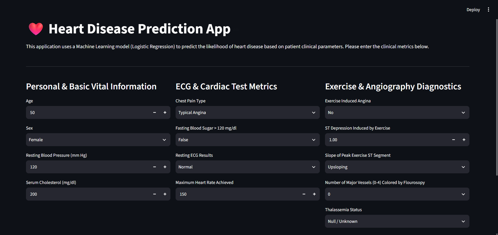
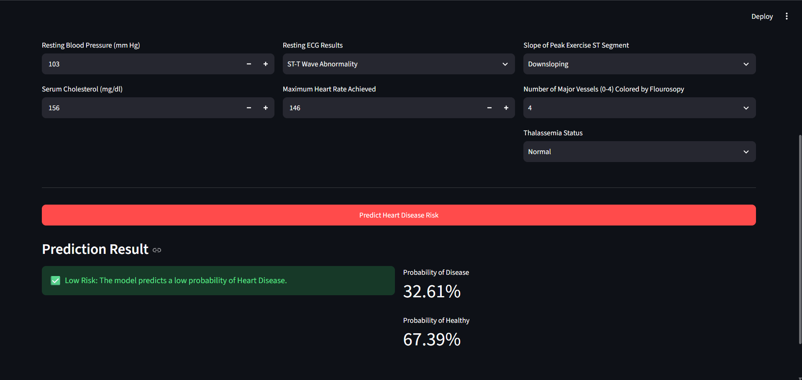

# ❤️ Heart Disease Prediction App

An end-to-end Machine Learning web application that predicts the likelihood of heart disease based on patient clinical parameters using a Logistic Regression classifier and Streamlit.

---

## 📌 Project Overview
This repository contains a complete, modular Machine Learning pipeline built on the UCI Heart Disease dataset. The application allows users or medical professionals to enter patient clinical metrics via an interactive web dashboard and receive real-time prediction results along with risk probability estimates.

---

## 📸 Application Screenshots

### 1. Main Dashboard Interface


### 2. Prediction Result


---

## 📁 Directory Structure

```text
heart_disease_project/
├── assets/
│   ├── app_preview.png
│   └── prediction_result.png
├── data/
│   └── heart.csv
├── models/
│   ├── heart_disease_model.pkl
│   └── scaler.pkl
├── app.py
├── model.ipynb
├── requirements.txt
├── README.md
└── .gitignore 
```

---

## 🛠️ Tech Stack & Tools
* **Language:** Python
* **Machine Learning & Pipeline:** `scikit-learn`, `pandas`, `numpy`
* **Data Visualization:** `matplotlib`, `seaborn`
* **Web Framework:** `streamlit`
* **Model Serialization:** `joblib`

---

## 📊 Model Performance & Diagnostics
The Logistic Regression model was trained and evaluated on a 20% stratified test split from the UCI Heart Disease dataset:
* **Preprocessing:** Standardized continuous clinical features using `StandardScaler` to ensure zero mean and unit variance.
* **Evaluation Metrics:** Evaluated using Accuracy Score, Confusion Matrix, and Classification Report (Precision, Recall, F1-Score).

---

## 🚀 How to Run Locally

### 1. Clone the Repository
```bash
git clone [https://github.com/Abdalrahman-Ebrahim/heart-disease-prediction.git](https://github.com/Abdalrahman-Ebrahim/heart-disease-prediction.git)
cd heart-disease-prediction
```

### 2. Set Up Environment & Install Dependencies
```bash
pip install -r requirements.txt
```

### 3. Launch the Streamlit App
```bash
python -m streamlit run app.py
```